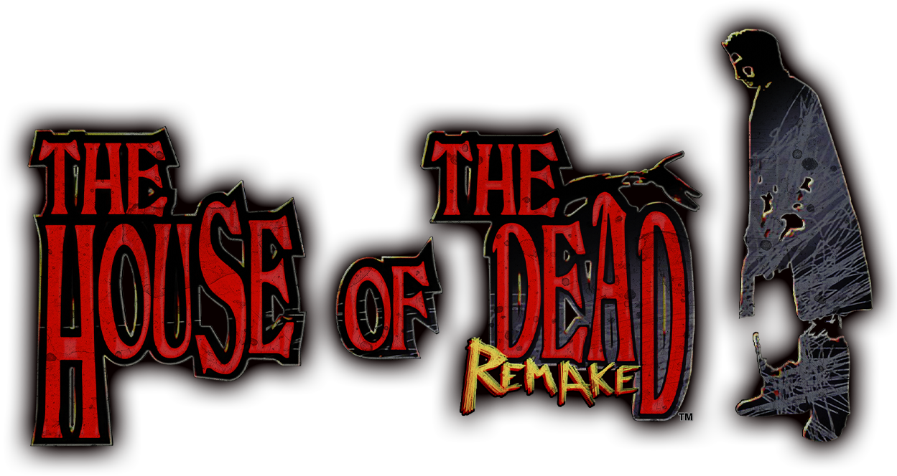
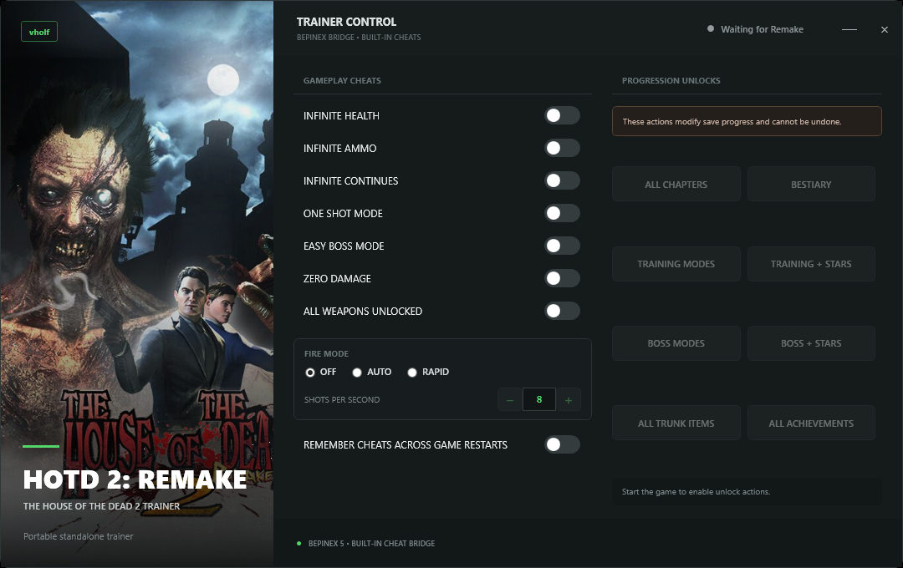

# The House of the Dead 2: Remake Trainer

A Windows trainer for the Steam version of **THE HOUSE OF THE DEAD 2: Remake**, by `vholf`.



Unlike a conventional standalone trainer, this project uses a small BepInEx
bridge to control the game's built-in cheat system. This also makes cheats
persistent: enable **Remember gameplay cheats across game restarts** once and
the bridge restores them on later game launches without starting the trainer
GUI again.



## Requirements

- 64-bit Windows
- THE HOUSE OF THE DEAD 2: Remake on Steam
- 64-bit [BepInEx 5.4.22](https://github.com/BepInEx/BepInEx/releases/download/v5.4.22/BepInEx_x64_5.4.22.0.zip)

Cheat Engine is not required. Use BepInEx 5 x64, not BepInEx 6 or the x86
package.

## Download

Download `Hotd2RemakeTrainer.exe` and `Hotd2TrainerBridge.dll` from the
repository's [Releases](https://github.com/fjdiazt/thotd2remake-trainer/releases)
page. Both files must come from the same release.

## Install

1. In Steam, right-click the game and select **Manage > Browse local files**.
2. Extract BepInEx directly into the folder containing
   `THE HOUSE OF THE DEAD 2 Remake.exe`.
3. Start the game once, reach the menu, then close it. This creates the BepInEx
   folders.
4. Copy `Hotd2TrainerBridge.dll` to:

   ```text
   <game folder>\BepInEx\plugins\Hotd2TrainerBridge.dll
   ```

5. Keep `Hotd2RemakeTrainer.exe` anywhere convenient.
6. Fully restart the game after installing or replacing the bridge DLL.

The game folder must contain `winhttp.dll` with that exact filename. Renaming
or removing it disables BepInEx.

## Use

1. Start THE HOUSE OF THE DEAD 2: Remake through Steam.
2. Run `Hotd2RemakeTrainer.exe`.
3. Wait for **Connected to Remake**.
4. Enable the options you want.

The trainer may also be opened first. It waits for the game and sends your
selected options when the bridge connects.

## Options

| Option | Behavior |
|---|---|
| Infinite Health | Keeps player health protected. |
| Infinite Ammo | Enables the game's infinite-ammo state. |
| Infinite Continues | Enables unlimited continue tokens. |
| One Shot Mode | Enables the game's built-in one-shot damage mode. |
| Easy Boss Mode | Enables the game's built-in easier-boss behavior. |
| Zero Damage | Enables the game's built-in zero-damage mode. |
| All Weapons Unlocked | Makes every weapon available while enabled. |
| Off | Disables both automatic fire modes. |
| Auto Fire (native max) | Holding the trigger uses the game's built-in automatic-fire loop at the weapon's native maximum cadence. |
| Rapid Fire | Holding the trigger repeats normal fire at the selected 2-16 shots-per-second rate while preserving ammo, reload, blocking, and cooldown rules. |
| Remember gameplay cheats across game restarts | Saves gameplay and fire-mode options in the bridge and restores them when the game starts. |

Auto Fire and Rapid Fire are mutually exclusive. Rapid Fire does not modify
per-shot damage.

### Progression unlocks

The trainer can unlock all chapters, bestiary entries, training modes, boss
modes, stars, trunk items, and achievements through the game's built-in
actions.

Unlocks modify save progress and cannot be undone by the trainer. Unlocking
achievements may also permanently unlock platform achievements, so the trainer
asks for confirmation first.

## Persistence

With **Remember gameplay cheats across game restarts** enabled:

- closing the GUI leaves selected cheats active;
- starting the game restores them without opening the GUI;
- reopening the GUI synchronizes its controls from the bridge.

With persistence disabled, closing the GUI turns all trainer options off.

Bridge state is saved in:

```text
<game folder>\BepInEx\config\local.hotd2remake.trainerbridge.cfg
```

GUI state is saved in:

```text
%LOCALAPPDATA%\vholf\Hotd2RemakeTrainer\settings.json
```

## Troubleshooting

- **Waiting for Remake:** start the game and leave the trainer open.
- **Game found; BepInEx bridge offline:** fully restart the game, then confirm
  `winhttp.dll` is beside the game executable and `Hotd2TrainerBridge.dll` is
  inside `BepInEx\plugins`.
- **GUI and bridge do not connect after an update:** download both files from
  the same release and restart the game.
- **Option unavailable:** restart both the game and trainer, then try again.

## Build from source

Building requires the .NET 8 SDK and a local game installation. The GUI uses
the published `Vholf.Trainer.UI` package version `0.1.0-ci.3`.

```powershell
.\build.ps1
```

Outputs:

```text
dist\Hotd2RemakeTrainer.exe
dist\Hotd2TrainerBridge.dll
```

Build and deploy the bridge to the default game path:

```powershell
.\build.ps1 -Deploy
```

Use `-GameRoot` for another Steam library.

The manual GitHub release workflow builds and tests the GUI on Windows,
selects the next patch version, and publishes both release files. The committed
bridge DLL is used because compiling it requires assemblies from a local game
installation.

## Architecture

- `src\Hotd2RemakeTrainer.App`: game-specific WPF controls, saved GUI state,
  process detection, and named-pipe session.
- `Vholf.Trainer.UI`: shared window chrome, artwork, and status presentation.
- `Hotd2TrainerBridge.cs`: in-game BepInEx plugin that executes and persists
  cheats.
- GUI and bridge communicate over `\\.\pipe\Hotd2RemakeTrainer` using the
  `STATE` and `ACTION` protocol.

## Disclaimer

Use at your own risk. This trainer is intended for offline, single-player use.
